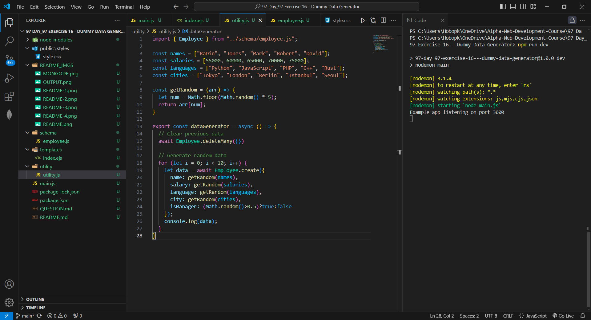
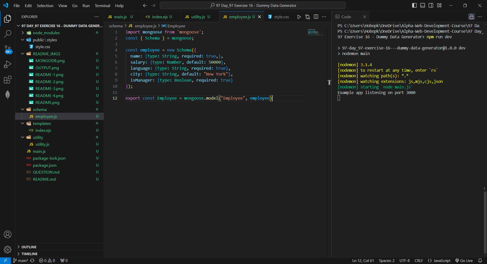
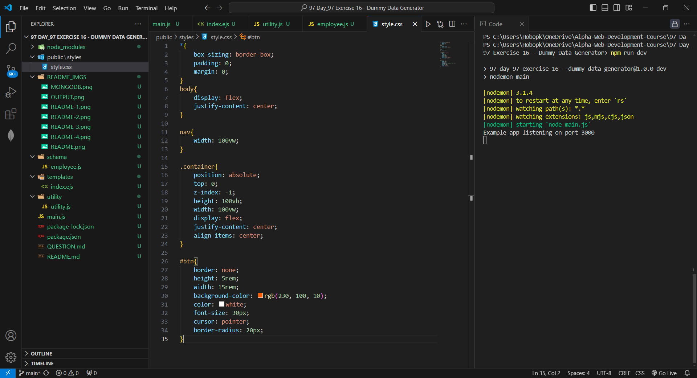
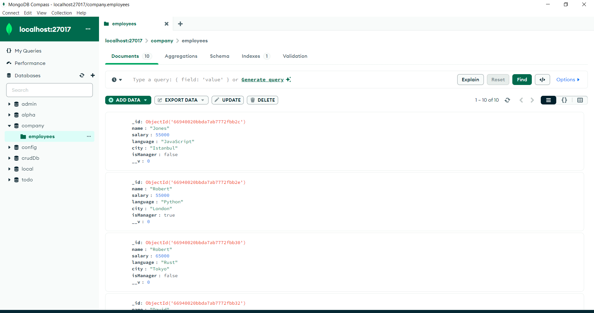

# Generate Dummy Data In Mongo DB

# QUESTION

# Main Server

# Home Page

# Utility Function

# Employee Schema

# Public Styles

# All Documents in MongoDB Compass

# Get One Document From /todo End Point
